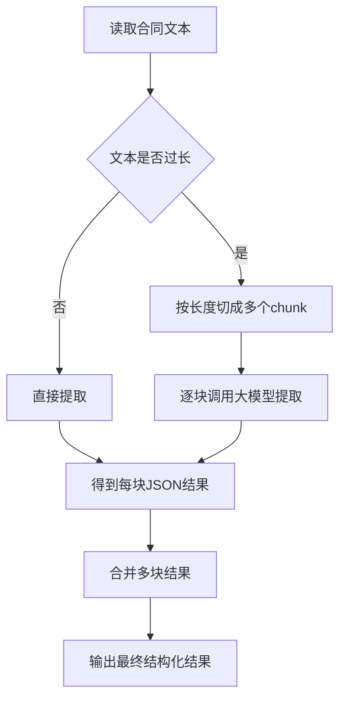
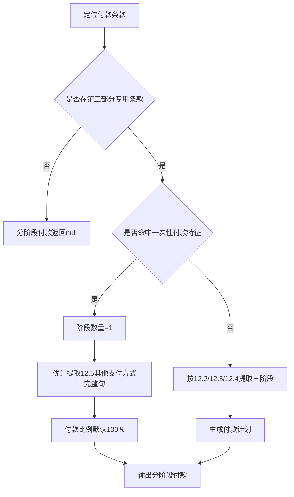

# 合同字段提取逻辑说明

- 系统是怎么从合同里提取字段的
- 为什么有时候会分块提取
- 一次性付款和分阶段付款是怎么判断的

## 1. 目的

系统会读取一份合同（Markdown文本），让大模型按固定模板提取信息，比如：
- 工程名称
- 合同编号
- 签约金额
- 发包人信息
- 分项价格表
- 分阶段付款

最终输出是一个固定结构的JSON，方便后续入库和业务使用。

## 2. 整体流程

## 3. 为什么要分块

有些合同非常长，一次发给大模型可能超出限制，或者影响稳定性。
所以系统会把合同切成多个片段（chunk）分别提取，再合并。

分块后，系统的合并原则是：
- 普通字段（字符串）：取第一个有效值
- 列表字段：合并并去重
- 字典字段：取第一个非空字典

这也是为什么Prompt里强调：
- 如果当前块没证据，宁可返回null/[]，不要猜
- 特别是分项价格表、分阶段付款，没证据时直接返回null，避免“首块误占位”

## 4. Prompt的核心规则

### 4.1 基础信息

第一页（目录之前）的工程名称、合同编号、签订日期，第一部分的签约金额等：
- 有明确文本证据才提取
- 没证据就返回null
- 不允许猜测或补全

### 4.2 分项价格表

系统会优先找“附件2：分项价格表”，找不到再回退找“价格表”。
支持普通文本表格和HTML表格。

提取结果包括：
- 分项价格表（逐行）
- 合计（优先取“合计”行最后一个有效金额）

### 4.3 分阶段付款（重点）

只允许从“第三部分 专用合同条款”提取付款计划。
“第二部分 通用合同条款”里的付款描述，默认当作模板噪声，不写入结果。

系统会先判断付款类型：

1) 一次性付款
- 典型信号：
  - “其他支付方式 + 一次性支付/一并支付/一次付清”
  - “12.3中期支付不适用”或“12.4费用结算不适用”
- 输出：阶段数量=1，付款比例默认100%（如果原文没写比例）

2) 三阶段付款
- 对应阶段：
  - 第一阶段：12.2（预付款/定金）
  - 第二阶段：12.3（中期支付）
  - 第三阶段：12.4（费用结算）

## 5. 付款提取流程图（重点）

## 6. “付款时间”为什么必须是完整句

业务上只提“30日内”信息不够，容易丢失触发条件。

所以规则要求：付款时间必须尽量保留完整原句，至少包含：
- 触发条件（比如“完成初步设计评审后”）
- 时限（比如“30日以内”）
- 支付动作（比如“发包人支付预付款”）

示例：
- 推荐：合同生效后并完成初步设计评审后30日以内，发包人支付预付款。
- 不推荐：30日以内。

